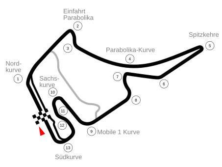

# Hockenheimring

## Podstawowe informacje

**Współczesna pełna nazwa:** Hockenheimring Baden-Württemberg  
**Nazwa podstawowa:** Hockenheimring  
**Lokalizacja:** Hockenheim, Badenia-Wirtembergia, Niemcy  
**Język nazwy:** niemiecki  
**Weryfikacja współczesnej nazwy:** 16 sierpnia 2026

## Układ toru

*Schemat na podstawie [Pitlane02, „Circuit Hockenheimring-2002.svg”, Wikimedia Commons](https://commons.wikimedia.org/wiki/File:Circuit_Hockenheimring-2002.svg), licencja [CC BY-SA 3.0](https://creativecommons.org/licenses/by-sa/3.0/). Strona pliku określa go jako własną pracę autora i schemat pełnego układu Hockenheimringu po przebudowie z 2002 roku. W kopii przechowywanej w repozytorium dodano wyłącznie metadane dostępnościowe (`role`, `aria-labelledby`, `title` i `desc`); geometria i wygląd grafiki pozostają bez zmian. Zmodyfikowana wersja pozostaje na licencji CC BY-SA 3.0.*

## Znaczenie nazwy

Nazwa **Hockenheimring** jest niemieckim złożeniem:

- `Hockenheim` – nazwa miasta, w którym znajduje się tor;
- `Ring` – element utrwalonej nazwy własnej obiektu wyścigowego.

Duden klasyfikuje `Hockenheimring` jako nazwę własną i definiuje ją jako **tor samochodowy w północnej Badenii**. Najnaturalniejsze polskie objaśnienie to więc **„tor wyścigowy w Hockenheim”** albo **„tor Hockenheim”**.

Nie należy tłumaczyć nazwy własnej mechanicznie jako „Pierścień Hockenheim”. W języku polskim pozostaje ona nazwą własną **Hockenheimring**.

## Skąd wzięła się nazwa Hockenheim

Nazwa miasta jest znacznie starsza niż sam tor. Oficjalna historia miasta podaje pierwszą wzmiankę o Hockenheim w **769 roku** w kodeksie klasztoru Lorsch.

Regionalny leksykon historyczny **LEO-BW** podaje historyczną formę **Ochinheim** z 769 roku, zachowaną w kopii z XII wieku, oraz stwierdza wprost, że nazwa pochodzi **od imienia osobowego**.

To jest najważniejsze ustalenie etymologiczne. Źródło nie podaje w tym miejscu pewnej rekonstrukcji tego imienia, dlatego nie należy dopowiadać form typu „Hocko” lub podobnych jako faktu.

Współczesne niemieckie słowo `Heim` ma według Dudena historyczne znaczenie „miejsca, gdzie człowiek się osiedla” lub „obozowiska”. Jest to użyteczna informacja językowa dotycząca elementu `-heim`, ale **nie stanowi samodzielnego dowodu etymologii nazwy Hockenheim**. W tym zakresie pierwszeństwo ma LEO-BW, które dla konkretnej nazwy miejscowej wskazuje pochodzenie od imienia osobowego.

Ciekawostką jest herb Hockenheim, w którym występują dwa skrzyżowane haki. LEO-BW zaznacza jednak wyraźnie, że haki są **ludowym, etymologicznym objaśnieniem nazwy miejscowości**. Nie dowodzą, że nazwa Hockenheim pochodzi od niemieckiego słowa oznaczającego hak.

## Związek miasta z nazwą toru

Tor powstał w Hockenheim. Według niemieckiej wersji oficjalnej historii obiektu **Ernst Christ** przedstawił pomysł stworzenia miejscowej trasy wyścigowej w 1930 roku. Rada miejska jednomyślnie zatwierdziła projekt 25 grudnia 1931 roku, szeroko zakrojone prace rozpoczęły się 23 marca 1932 roku, a pierwszy wyścig motocyklowy odbył się **29 maja 1932 roku**.

Nazwa toru ma więc bezpośrednio charakter geograficzny: **Hockenheimring to tor związany z miastem Hockenheim**.

## Uwaga o rozbieżności w oficjalnych źródłach

Audyt według playbooka ujawnił drobną rozbieżność w samym serwisie Hockenheimringu:

- niemiecka wersja oficjalnej historii podaje pierwszy wyścig **29 maja 1932 roku**;
- aktualna strona `Daten & Fakten` również podaje otwarcie **29.05.1932**;
- angielska wersja strony historycznej podaje natomiast **25 maja 1932 roku**.

Ponieważ dwa niezależne miejsca w niemieckiej wersji oficjalnego serwisu są zgodne co do 29 maja, a także jest to data eksponowana w aktualnych danych obiektu, w tym opracowaniu przyjęto **29 maja 1932 roku**. Angielską datę 25 maja traktuje się jako prawdopodobną niespójność tłumaczenia lub redakcji strony, a nie jako podstawę do zmiany chronologii.

## Historyczne nazwy i rozwój obiektu

W **1938 roku** pierwotną trójkątną trasę gruntownie przebudowano. Oficjalna historia Hockenheimringu opisuje zmianę jako przejście od `Dreieckskurs` do **Kurpfalzring**. Po dodaniu Ostkurve i poszerzeniu trasy obiekt stał się szybkim torem o charakterystycznym, zbliżonym do owalnego układzie.

Nazwa **Kurpfalzring** odnosiła się do **Kurpfalz**, czyli historycznego Palatynatu Elektorskiego. Sam Hockenheim należał do tego obszaru historycznego, a oficjalna historia toru jeszcze w opisie jego późniejszego rozwoju określa Hockenheimring jako obiekt w sercu Kurpfalz.

Na początku lat 60. planowana autostrada Mannheim–Walldorf wymusiła kolejną zmianę układu. Ernst Christ opracował w 1961 roku koncepcję **Motodromu**, którego budowa rozpoczęła się w 1964 roku, a otwarcie nastąpiło w 1966 roku.

Kolejna fundamentalna przebudowa rozpoczęła się w **2002 roku**. Oficjalna historia podaje, że ze względu na długość starego, 6,8-kilometrowego układu i ograniczoną widoczność leśnych odcinków zaprojektowano krótszą trasę. Współczesny Grand-Prix-Kurs ma długość **4,574 km**.

## Współczesna nazwa

Aktualna oficjalna strona `Daten & Fakten` posługuje się pełną nazwą **Hockenheimring Baden-Württemberg**. Ponieważ nie jest to człon sponsorski, lecz obecna oficjalna forma nazwy obiektu, zapisujemy ją oddzielnie od krótszej i powszechnie używanej nazwy **Hockenheimring**.

## Jak rozumieć nazwę po polsku

Warto rozróżnić:

- **nazwa własna:** Hockenheimring;
- **współczesna pełna nazwa:** Hockenheimring Baden-Württemberg;
- **pochodzenie bezpośrednie:** nazwa miasta Hockenheim + utrwalony niemiecki człon `Ring` w nazwie toru;
- **naturalne polskie objaśnienie:** „tor wyścigowy w Hockenheim” lub „tor Hockenheim”;
- **starsza forma nazwy miasta:** Ochinheim, odnotowana dla 769 roku;
- **pochodzenie nazwy miasta:** według LEO-BW od imienia osobowego;
- **dawna nazwa toru po przebudowie z 1938 roku:** Kurpfalzring.

Nie należy wyprowadzać nazwy Hockenheim od haków przedstawionych w herbie. Regionalny leksykon historyczny określa takie skojarzenie jako etymologię ludową.

## Źródła

### Źródła oficjalne i pierwotne

- [Hockenheimring – Geschichte](https://www.hockenheimring.de/infos/hockenheimring/geschichte/) – niemieckojęzyczna oficjalna historia toru; projekt Ernsta Christa, decyzja rady miejskiej, rozpoczęcie prac 23 marca 1932 roku, pierwszy wyścig 29 maja 1932 roku, Kurpfalzring, Motodrom i przebudowa z 2002 roku.
- [Hockenheimring – Daten & Fakten](https://www.hockenheimring.de/infos/hockenheimring/daten-fakten/) – współczesna nazwa Hockenheimring Baden-Württemberg, data otwarcia 29.05.1932 i parametry Grand-Prix-Kurs.
- [Hockenheimring – History, wersja angielska](https://www.hockenheimring.de/en/info/hockenheimring/history/) – angielska wersja oficjalnej historii; wykorzystana do wykrycia rozbieżności daty pierwszego wyścigu, ponieważ podaje 25 maja 1932 roku.
- [Stadt Hockenheim – Stadtgeschichte](https://www.hockenheim.de/startseite/kultur/stadtgeschichte.html) – oficjalna historia miasta; pierwsza wzmianka w 769 roku.
- [Stadt Hockenheim – Bruchbuden, von wegen!](https://www.hockenheim.de/startseite/kultur/bruchbuden%2B-%2Bvon%2Bwegen_.html) – oficjalny materiał historyczny miasta przytaczający formę `Ochinheim` dla pierwszej wzmianki.
- [LEO-BW – Hockenheim, Altgemeinde/Teilort](https://www.leo-bw.de/web/guest/detail-gis/-/Detail/details/ORT/labw_ortslexikon/6362/Hockenheim) – historyczna forma `Ochinheim` z 769 roku oraz informacja, że nazwa pochodzi od imienia osobowego.
- [LEO-BW – Hockenheim, herb](https://www.leo-bw.de/detail-gis/-/Detail/details/ORT/labw_ortslexikon/6359/Hockenheim) – opis herbu i jednoznaczne określenie skrzyżowanych haków jako ludowego objaśnienia nazwy.

### Źródła językowe

- [Duden – Hockenheimring](https://www.duden.de/rechtschreibung/Hockenheimring) – forma `Hockenheimring`, alternatywna pisownia `Hockenheim-Ring` i klasyfikacja jako nazwy własnej toru samochodowego w północnej Badenii.
- [Duden – Heim](https://www.duden.de/rechtschreibung/Heim) – historyczne znaczenie słowa `Heim`; wykorzystane wyłącznie jako tło językowe, a nie jako samodzielny dowód etymologii Hockenheim.

### Źródło grafiki

- [Wikimedia Commons – Circuit Hockenheimring-2002.svg](https://commons.wikimedia.org/wiki/File:Circuit_Hockenheimring-2002.svg) – schemat układu po 2002 roku autorstwa Pitlane02, własna praca, licencja CC BY-SA 3.0.

---

## Stopka redakcyjna

**Charakter opracowania:** popularnonaukowe objaśnienie etymologii i pochodzenia nazwy toru.  
**Język opracowania:** polski; nazwy własne pozostawiane są w formie oryginalnej.  
**Zasada źródłowa:** badania wykonano ponownie według playbooka projektu, z pierwszeństwem dla niemieckojęzycznych źródeł lokalnych, oficjalnego serwisu toru, regionalnego leksykonu historycznego i źródeł językowych.  
**Zasada tłumaczenia:** rozróżniane są nazwa własna, jej budowa językowa i naturalne polskie objaśnienie.  
**Zasada konfliktu źródeł:** rozbieżność 25/29 maja 1932 roku została zachowana i wyjaśniona zamiast arbitralnie ukryta.  
**Zasada grafiki:** zachowywane są informacje o autorze i licencji; zmiany dostępnościowe w SVG są jawnie oznaczane.  
**Ostatnia aktualizacja:** 16 sierpnia 2026.
