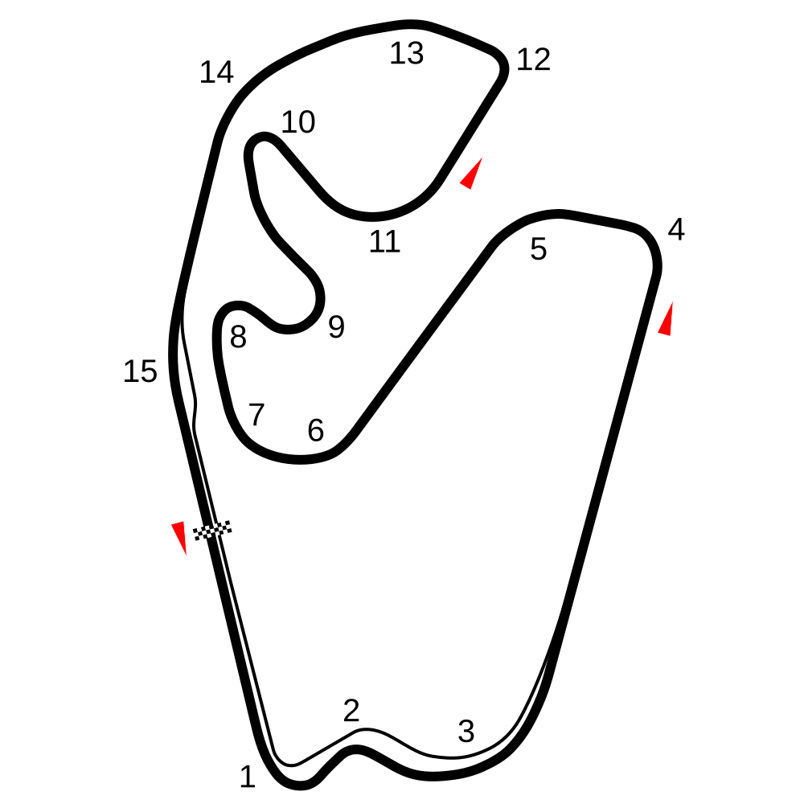

# Interlagos

## Podstawowe informacje

**Oficjalna nazwa:** Autódromo José Carlos Pace  
**Nazwa powszechnie używana:** Interlagos  
**Lokalizacja:** São Paulo, Brazylia  
**Język nazwy:** portugalski

## Układ toru

*Schemat: [Sas1998, „2014 Interlagos circuit map.svg”, Wikimedia Commons](https://commons.wikimedia.org/wiki/File:2014_Interlagos_circuit_map.svg), licencja [CC BY-SA 4.0](https://creativecommons.org/licenses/by-sa/4.0/). W repozytorium przechowywana jest kopia oryginalnego pliku SVG z Wikimedia Commons.*

## Znaczenie nazwy

Nazwa **Interlagos** oznacza po portugalsku dosłownie **„między jeziorami”** albo naturalniej po polsku **„pomiędzy jeziorami”**.

W tym przypadku znaczenie nazwy jest zarazem opisem położenia geograficznego. Teren, na którym rozwijano dzielnicę Interlagos i później zbudowano tor, znajduje się pomiędzy dwoma dużymi zbiornikami wodnymi São Paulo: **Guarapiranga** i **Billings**.

## Skąd wzięła się nazwa

Nazwa **Interlagos** nie została wymyślona specjalnie dla toru. Najpierw odnosiła się do projektowanej dzielnicy i obszaru w południowej części São Paulo.

W latach 20. XX wieku brytyjski inżynier **Louis Romero Sanson** planował w tej części miasta nowe osiedle o charakterze wypoczynkowo-mieszkaniowym. W przedsięwzięciu uczestniczył francuski urbanista **Alfred Agache**. Według oficjalnej historii miasta to właśnie Agache zaproponował nazwę **Interlagos**, ponieważ okolica położona między zbiornikami Guarapiranga i Billings przypominała mu szwajcarskie **Interlaken**.

To podobieństwo jest szczególnie interesujące językowo: nazwa szwajcarskiego Interlaken również jest tradycyjnie objaśniana jako odnosząca się do położenia „między jeziorami”. Brazylijskie **Interlagos** można więc traktować jako portugalskie nawiązanie do tej samej idei geograficznej.

## Związek nazwy z torem

Budowa toru rozpoczęła się w **1938 roku**, a obiekt otwarto w **1940 roku**. Ponieważ znajdował się na obszarze Interlagos, nazwa dzielnicy przeszła również na sam tor.

Do dziś określenie **Interlagos** jest powszechnie używane na świecie jako nazwa toru, mimo że jego oficjalna nazwa brzmi obecnie **Autódromo José Carlos Pace**.

## José Carlos Pace

W **1985 roku** obiekt otrzymał nazwę **Autódromo Municipal José Carlos Pace** na cześć brazylijskiego kierowcy Formuły 1 **José Carlosa Pace'a**, który zginął w katastrofie lotniczej w 1977 roku.

Pace był szczególnie związany z tym miejscem: w **1975 roku wygrał Grand Prix Brazylii na Interlagos**. Było to jego jedyne zwycięstwo w mistrzostwach świata Formuły 1.

W praktyce funkcjonują więc równolegle dwa poziomy nazewnictwa:

- **oficjalna nazwa obiektu:** Autódromo José Carlos Pace;
- **historyczna i powszechnie używana nazwa:** Interlagos.

## Jak rozumieć nazwę po polsku

Najlepiej rozróżnić nazwę własną i jej znaczenie:

- **nazwa własna:** Interlagos;
- **dosłowne znaczenie:** „między jeziorami”;
- **objaśnienie geograficzne:** obszar położony pomiędzy zbiornikami Guarapiranga i Billings.

Nie ma potrzeby tłumaczyć nazwy toru w normalnym użyciu jako „Tor Między Jeziorami”. Polskie tłumaczenie służy przede wszystkim do objaśnienia etymologii.

## Źródła

### Źródła oficjalne

- [Prefeitura de São Paulo – História do Autódromo de Interlagos](https://prefeitura.sp.gov.br/web/autodromodeinterlagos/historia) – historia powstania dzielnicy i toru oraz późniejsza historia obiektu.
- [Prefeitura de São Paulo – Linha do tempo](https://prefeitura.sp.gov.br/web/autodromodeinterlagos/linhadotempo) – oficjalna chronologia; wskazuje, że nazwę Interlagos zaproponował Alfred Agache ze względu na położenie między zbiornikami Guarapiranga i Billings.
- [Prefeitura de São Paulo – O autódromo José Carlos Pace – Interlagos](https://prefeitura.sp.gov.br/web/governo/w/institucional/348583) – opis związku nazwy Interlagos z Interlaken i położeniem między dwoma zbiornikami oraz historia toru.
- [Prefeitura de São Paulo – Circuito](https://autodromodeinterlagos.prefeitura.sp.gov.br/circuito) – oficjalne informacje o współczesnym torze i jego parametrach.
- [Prefeitura de São Paulo – História](https://autodromodeinterlagos.prefeitura.sp.gov.br/historia) – informacja o nadaniu w 1985 roku imienia José Carlosa Pace'a.

### Źródło uzupełniające

- [Formula 1 – F1’s one-win wonders: Carlos Pace – Brazil 1975](https://www.formula1.com/en/latest/article/f1s-one-win-wonders-how-many-do-you-remember.ACFv9zfw3goSK4FrEDz28) – potwierdza zwycięstwo Pace'a na Interlagos w 1975 roku, fakt, że było to jego jedyne zwycięstwo w Grand Prix, oraz późniejsze nadanie torowi jego imienia.

---

## Stopka redakcyjna

**Charakter opracowania:** popularnonaukowe objaśnienie etymologii i pochodzenia nazwy toru.  
**Język opracowania:** polski; nazwy własne pozostawiane są w formie oryginalnej.  
**Zasada źródłowa:** w pierwszej kolejności wykorzystywane są źródła oficjalne i historyczne; źródła wtórne służą do uzupełnienia kontekstu.  
**Zasada tłumaczenia:** rozróżniane są nazwa własna, tłumaczenie dosłowne i objaśnienie geograficzne.  
**Ostatnia aktualizacja:** 16 sierpnia 2026.
