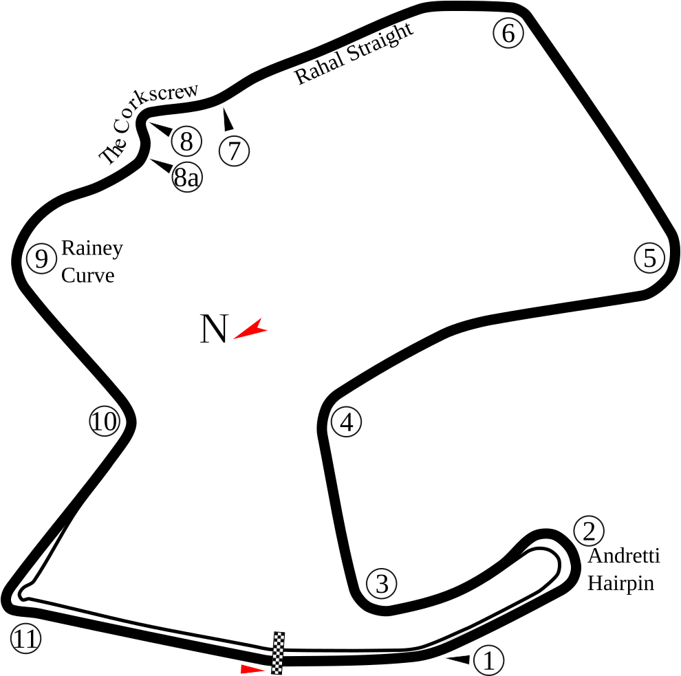

# Laguna Seca

## Podstawowe informacje

**Pełna współczesna nazwa:** WeatherTech Raceway Laguna Seca  
**Lokalizacja:** Monterey County, Kalifornia, Stany Zjednoczone  
**Język nazwy:** hiszpański

## Układ toru

*Schemat: [Will Pittenger, „Laguna Seca.svg”, Wikimedia Commons](https://commons.wikimedia.org/wiki/File:Laguna_Seca.svg), licencja [CC BY-SA 3.0](https://creativecommons.org/licenses/by-sa/3.0/). Kopia w tym repozytorium została zmodyfikowana wyłącznie przez dodanie metadanych dostępności (`role`, `aria-labelledby`, `title`, `desc`); geometria i wygląd grafiki nie zostały zmienione. Zmodyfikowana wersja pozostaje na licencji CC BY-SA 3.0.*

## Znaczenie nazwy

Nazwa **Laguna Seca** pochodzi z języka hiszpańskiego:

- `laguna` – naturalny zbiornik wodny, zwykle mniejszy od jeziora;
- `seca` – sucha, pozbawiona wody.

Dosłownie nazwę można więc oddać jako **„Sucha Laguna”**. W polskim objaśnieniu sensu spotyka się też sformułowania **„suche jezioro”** lub **„wyschnięte jezioro”**, ale nie są one ścisłym tłumaczeniem słowo w słowo.

Nie oznacza to, że w zwykłym użyciu należy tłumaczyć nazwę własną toru na polski. `Laguna Seca` pozostaje nazwą własną, a polskie sformułowanie służy jedynie do wyjaśnienia jej sensu.

## Skąd wzięła się nazwa

Nazwa nie została wymyślona specjalnie dla toru wyścigowego. Określenie **Laguna Seca** funkcjonowało w tej części Kalifornii znacznie wcześniej. Zachowały się historyczne dokumenty dotyczące **Rancho Laguna Seca**, w tym materiały związane z dawnymi hiszpańsko-meksykańskimi nadaniami ziemskimi i późniejszą dokumentacją amerykańską.

Sam tor powstał w **1957 roku** na części terenu należącego wówczas do amerykańskiego Fort Ord. Oficjalna historia WeatherTech Raceway Laguna Seca podaje, że pierwszy wyścig odbył się 9 listopada 1957 roku. Źródła motorsportowe opisują teren budowy jako obszar wokół wyschniętego dna zbiornika wodnego, co dobrze odpowiada znaczeniu nazwy.

## Jak rozumieć nazwę po polsku

Najbezpieczniej rozróżnić trzy poziomy:

- **nazwa własna:** Laguna Seca;
- **dosłowne znaczenie:** „Sucha Laguna”;
- **swobodne objaśnienie geograficzne:** „suche” lub „wyschnięte jezioro”.

Pełną nazwę `WeatherTech Raceway Laguna Seca` można opisowo rozumieć jako tor wyścigowy Laguna Seca, którego obecny człon sponsorski pochodzi od firmy WeatherTech.

## Źródła

### Źródła pierwotne i oficjalne

- [WeatherTech Raceway Laguna Seca – Track Information](https://weathertechraceway.com/pages/track-information) – oficjalna historia toru; budowa w 1957 roku, Fort Ord i pierwszy wyścig.
- [California State University Monterey Bay – Laguna Seca: Diseños, GLO No. 276, Monterey County, and associated historical documents](https://digitalcommons.csumb.edu/hornbeck_cgb_2_a/44/) – historyczne dokumenty dotyczące Rancho Laguna Seca, pokazujące, że nazwa miejsca funkcjonowała przed powstaniem toru.
- [Real Academia Española – „laguna”](https://dle.rae.es/laguna) – znaczenie hiszpańskiego rzeczownika `laguna`.
- [Real Academia Española – „seco, seca”](https://dle.rae.es/seco) – znaczenie przymiotnika `seco/seca`, w tym bezpośrednio w odniesieniu do laguny pozbawionej wody.
- [County of Monterey – Parks Division](https://www.countyofmonterey.gov/government/departments-i-z/public-works-facilities-parks/county-parks) – oficjalne informacje historyczne o Laguna Seca Recreation Area i rozwoju obiektu.

### Źródło uzupełniające

- [IMSA – Six Reasons to Love WeatherTech Raceway Laguna Seca](https://www.imsa.com/news/2023/05/09/six-reasons-to-love-weathertech-raceway-laguna-seca/) – opis budowy toru w 1957 roku wokół wyschniętego dna zbiornika wodnego.

---

## Stopka redakcyjna

**Charakter opracowania:** popularnonaukowe objaśnienie etymologii i pochodzenia nazwy toru.  
**Język opracowania:** polski; nazwy własne pozostawiane są w formie oryginalnej.  
**Zasada źródłowa:** w pierwszej kolejności wykorzystywane są źródła oficjalne, archiwalne i językowe; źródła wtórne służą do uzupełnienia kontekstu.  
**Zasada tłumaczenia:** rozróżniane są nazwa własna, tłumaczenie dosłowne i swobodne objaśnienie znaczenia.  
**Ostatnia aktualizacja:** 16 sierpnia 2026.
