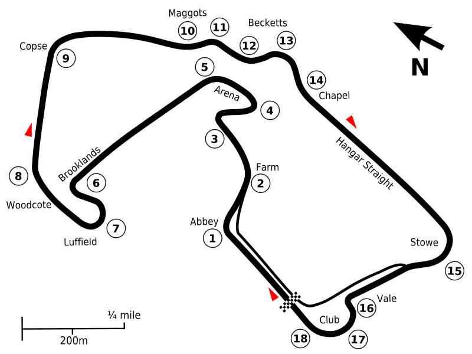

# Silverstone

## Podstawowe informacje

**Współczesna oficjalna nazwa:** Silverstone Circuit  
**Operator:** Silverstone Circuits Limited  
**Lokalizacja:** Silverstone / okolice Towcester, Northamptonshire, Anglia, Wielka Brytania  
**Język nazwy:** angielski; etymologia nazwy miejscowej sięga staroangielskiego  
**Charakter nazwy:** geograficzny – tor przejął nazwę od pobliskiej miejscowości Silverstone  
**Weryfikacja współczesnego nazewnictwa:** 16 sierpnia 2026

## Układ toru

*Schemat na podstawie [AlexJ, „Circuit Silverstone 2011.svg”, Wikimedia Commons](https://commons.wikimedia.org/wiki/File:Circuit_Silverstone_2011.svg), licencja [CC0 1.0](https://creativecommons.org/publicdomain/zero/1.0/). Strona pliku określa grafikę jako własną pracę autora i wskazuje, że przedstawia układ Grand Prix używany od 2011 roku. W kopii przechowywanej w repozytorium dodano wyłącznie metadane dostępności (`role`, `aria-labelledby`, `title` i `desc`); geometria i wygląd grafiki nie zostały zmienione.*

## Znaczenie nazwy

Na pierwszy rzut oka współczesne angielskie słowo **Silverstone** można byłoby mechanicznie rozłożyć na `silver` – „srebro / srebrny” i `stone` – „kamień”. Takie objaśnienie jest jednak mylące jako etymologia nazwy własnej.

Historyczne źródła i opracowania językowe wskazują, że nazwa miejscowości **Silverstone** prawdopodobnie pochodzi od staroangielskiej nazwy osobowej **Sigewulf** albo **Sæwulf** oraz elementu **`tūn`**, oznaczającego gospodarstwo, posiadłość lub osadę.

Najbezpieczniejsze naturalne objaśnienie po polsku brzmi więc:

**„gospodarstwo / osada Sigewulfa albo Sæwulfa”.**

Nie należy tłumaczyć nazwy toru jako **„Srebrny Kamień”**. Taki przekład odpowiada jedynie współczesnemu skojarzeniu graficznemu z angielskimi słowami `silver` i `stone`, a nie najlepiej potwierdzonej etymologii nazwy miejscowej.

## Skąd wzięła się nazwa Silverstone

Silverstone jest starą nazwą miejscową. Miejscowość pojawia się już w **Domesday Book z 1086 roku**. W źródłach dotyczących Domesday występują formy **`Selvestone`** i **`Silvestone`**.

Te dawne zapisy są ważne, ponieważ pokazują, że obecna końcówka przypominająca współczesne angielskie `stone` nie musi pochodzić od wyrazu oznaczającego kamień. Opracowania etymologiczne interpretują drugi człon jako staroangielskie **`tūn`** – „gospodarstwo, posiadłość, osada”.

Dictionary of American Family Names, cytowany przez FamilySearch i Ancestry dla nazwiska pochodzącego od tej miejscowości, podaje jako najbardziej prawdopodobne źródło pierwszy człon od imienia **Sigewulf** lub **Sæwulf**. Lokalny serwis miejscowości również podsumowuje znaczenie jako „farm/settlement of Saewulf/Sigewulf”.

Ponieważ źródła wskazują dwie możliwe formy imienia, nie należy arbitralnie wybierać jednej z nich jako bezspornie pewnej.

## Związek nazwy miejscowości z torem

Nazwa toru pochodzi bezpośrednio od pobliskiej miejscowości **Silverstone**.

Formula 1 w oficjalnym objaśnieniu nazw zakrętów Silverstone opisuje zakręt `Village` jako nazwany od najbliższej wsi, **która dała również nazwę samemu torowi**.

Tor nie otrzymał więc nazwy od materiału, koloru, kamienia ani sponsora. Jest to przede wszystkim **nazwa geograficzna** przejęta od istniejącej wcześniej miejscowości.

## Od lotniska RAF do toru wyścigowego

Teren współczesnego toru był podczas II wojny światowej bazą **RAF Silverstone**.

Oficjalna historia Silverstone podaje, że po wojnie Wielka Brytania miała niewiele odpowiednich obiektów wyścigowych, natomiast dysponowała licznymi lotniskami wojskowymi. Na terenie dawnej bazy RAF zaczęto więc organizować wyścigi.

Formula 1 wskazuje, że pierwsze nieformalne przejazdy wyścigowe odbyły się w **1947 roku**. Była to jeszcze improwizowana aktywność na terenie lotniska.

Za pierwszy oficjalny duży meeting toru Silverstone uznaje się natomiast **2 października 1948 roku**, kiedy Royal Automobile Club zorganizował tam International Grand Prix / British Grand Prix. Oficjalna historia Silverstone podaje, że wyścig wygrał Luigi Villoresi w Maserati.

To rozróżnienie jest ważne: **1947** odnosi się do pierwszych nieformalnych prób wykorzystania lotniska do ścigania, natomiast **1948** do pierwszego oficjalnego dużego wydarzenia wyścigowego.

## Silverstone i początki Formuły 1

**13 maja 1950 roku** Silverstone było gospodarzem pierwszej rundy nowo utworzonych mistrzostw świata Formuły 1. Wyścig wygrał Giuseppe Farina w Alfie Romeo.

W 1951 roku British Racing Drivers’ Club przejął dzierżawę obiektu od Royal Automobile Club i rozpoczął stopniowe przekształcanie dawnego lotniska w bardziej trwały kompleks wyścigowy.

Choć konfiguracja toru wielokrotnie się zmieniała, nazwa **Silverstone** pozostała niezmienna i nadal odnosi obiekt do historycznej miejscowości.

## Współczesny układ i nazwa

Aktualna oficjalna strona używa nazwy **Silverstone Circuit**. Nie występuje obecnie stały człon sponsorski stanowiący część nazwy toru.

Współczesny układ Grand Prix ma **5,891 km** i **18 zakrętów**. Obecna zasadnicza konfiguracja powstała po przebudowie z 2010 roku, a od 2011 roku wyścigi Formuły 1 korzystają z nowego kompleksu boksów i budynku `The Wing`.

## Nazwy charakterystycznych elementów toru

Silverstone ma wyjątkowo rozbudowany system nazw zakrętów, prostych i sekcji. Poniżej podano charakterystyczne elementy w kolejności przejazdu współczesnego okrążenia Grand Prix. Numery zakrętów są pomocnicze; istotą tej sekcji są utrwalone nazwy i ich pochodzenie.

### Hamilton Straight

**Rodzaj:** prosta startowa i boksowa współczesnego układu Grand Prix.  
**Pochodzenie nazwy:** Lewis Hamilton.

Do grudnia 2020 roku odcinek był znany jako **International Pits Straight**. British Racing Drivers’ Club przemianował go na Hamilton Straight po zdobyciu przez Lewisa Hamiltona siódmego mistrzostwa świata Formuły 1. Silverstone podkreślało przy tej okazji, że był to pierwszy przypadek w historii toru, gdy jego część nazwano imieniem konkretnej osoby.

### Abbey — zakręt 1

**Rodzaj:** zakręt.  
**Pochodzenie nazwy:** Luffield Abbey.

Nazwa odnosi się do dawnego opactwa Luffield, którego pozostałości znajdowały się w pobliżu toru. To przykład nazwy przeniesionej z lokalnego obiektu historycznego.

### Farm — zakręt 2

**Rodzaj:** zakręt; wcześniej nazwa odcinka prostego.  
**Pochodzenie nazwy:** pobliskie gospodarstwo.

Pierwotnie `Farm` odnosiło się do krótkiej prostej przebiegającej obok gospodarstwa. Po przebudowie układu w 2010 roku nazwa pozostała, choć oznacza dziś łagodny zakręt.

### Village — zakręt 3

**Rodzaj:** zakręt.  
**Pochodzenie nazwy:** wieś Silverstone.

`Village` odnosi się do najbliższej miejscowości — Silverstone. Jest to szczególnie interesujące dla projektu, ponieważ ta sama miejscowość dała nazwę całemu torowi.

### The Loop — zakręt 4

**Rodzaj:** nawrót / ciasny zakręt.  
**Pochodzenie nazwy:** kształt elementu.

To nazwa czysto opisowa. Formula 1 wskazuje, że `The Loop` jest jedynym zakrętem Silverstone nazwanym bezpośrednio od swojego kształtu.

### Aintree — zakręt 5

**Rodzaj:** zakręt.  
**Pochodzenie nazwy:** Aintree.

Nazwa upamiętnia Aintree — obiekt znany dziś przede wszystkim z wyścigów konnych, który w latach 1955–1962 pięciokrotnie gościł Grand Prix Wielkiej Brytanii Formuły 1. Jest to nazwa odwołująca się do innego historycznego miejsca brytyjskiego motorsportu.

### Wellington Straight

**Rodzaj:** prosta.  
**Pochodzenie nazwy:** bombowce Vickers Wellington i lotnicza przeszłość Silverstone.

Odcinek nosił wcześniej nazwę **National Straight**. Gdy w 2010 roku stał się częścią nowego układu Grand Prix, otrzymał nazwę Wellington Straight. Prosta powstała na fragmencie dawnego pasa lotniska RAF Silverstone, z którego korzystały bombowce Wellington.

### Brooklands — zakręt 6

**Rodzaj:** zakręt.  
**Pochodzenie nazwy:** Brooklands.

Nazwa jest hołdem dla historycznego toru Brooklands, jednego z najważniejszych miejsc w początkach brytyjskich wyścigów samochodowych i gospodarza pierwszych Grand Prix Wielkiej Brytanii w latach 1926–1927.

### Luffield — zakręt 7

**Rodzaj:** zakręt.  
**Pochodzenie nazwy:** Luffield Chapel / Luffield Abbey.

Nazwa odwołuje się do tego samego lokalnego kompleksu historycznego co `Abbey`. Przed zmianami układu zakręt był przez pewien czas rozdzielony na `Luffield 1` i `Luffield 2`.

### Woodcote — zakręt 8

**Rodzaj:** zakręt.  
**Pochodzenie nazwy:** Woodcote Park.

Woodcote Park w Surrey jest obiektem związanym z Royal Automobile Club. RAC organizował pierwsze duże wyścigi na Silverstone i miał wpływ na nazewnictwo wczesnych elementów toru.

### National Pits Straight

**Rodzaj:** prosta.  
**Pochodzenie nazwy:** funkcjonalne powiązanie z dawną linią start/meta i układem National.

Współczesne materiały Silverstone nadal używają określenia `National Pits Straight` dla odcinka obejmującego pierwotną linię start/meta toru. Nie odnaleziono jednak źródła dokumentującego konkretny moment formalnego nadania tej nazwy. Można więc dobrze potwierdzić **użycie i funkcję**, ale nie należy dopowiadać nieudokumentowanej historii nazewniczej.

### Copse — zakręt 9

**Rodzaj:** zakręt.  
**Pochodzenie nazwy:** pobliskie zagajniki.

Angielskie `copse` oznacza niewielki zagajnik. Zakręt przebiega blisko miejsc określanych jako Chapel Copse i Cheese Copse, od których wywodzi się jego nazwa.

### Maggotts — zakręty 10–11

**Rodzaj:** początek szybkiej sekwencji zakrętów.  
**Pochodzenie nazwy:** Maggots Moor.

Nazwa nie pochodzi od angielskiego `maggot` oznaczającego larwę, lecz od pobliskiego obszaru **Maggots Moor**. W oficjalnych materiałach spotyka się warianty zapisu `Maggotts` i `Maggots`; w tym opracowaniu zachowano formę `Maggotts` stosowaną w aktualnym objaśnieniu Formuły 1, a wariant `Maggots` odnotowano jako rzeczywiście używany przez operatora toru.

### Becketts — zakręty 12–13

**Rodzaj:** część szybkiej sekwencji.  
**Pochodzenie nazwy:** kaplica św. Tomasza Becketa.

`Becketts` odwołuje się do średniowiecznej kaplicy upamiętniającej Tomasza Becketa, arcybiskupa Canterbury zamordowanego w 1170 roku. Kaplica znajdowała się w pobliżu i została rozebrana w 1943 roku podczas budowy lotniska.

### Chapel — zakręt 14

**Rodzaj:** końcowa część szybkiej sekwencji.  
**Pochodzenie nazwy:** ta sama średniowieczna kaplica związana z Tomaszem Becketem.

`Chapel` i `Becketts` mają wspólne źródło historyczne, choć funkcjonują jako odrębne nazwy kolejnych elementów toru.

### Hangar Straight

**Rodzaj:** prosta.  
**Pochodzenie nazwy:** hangary RAF Silverstone.

W czasach, gdy teren był bazą Royal Air Force, w pobliżu późniejszej prostej stały duże hangary lotnicze. Nazwa zachowuje więc bezpośrednią pamięć o wojskowej historii miejsca.

### Stowe — zakręt 15

**Rodzaj:** zakręt.  
**Pochodzenie nazwy:** Stowe School.

Zakręt znajdujący się na końcu Hangar Straight otrzymał nazwę od pobliskiej Stowe School położonej na południe od toru.

### Vale — zakręt 16

**Rodzaj:** zakręt / fragment między Stowe i Club.  
**Pochodzenie nazwy:** niepewne.

Oficjalne materiały Formuły 1 zachowują co najmniej dwie interpretacje. `Vale` może odnosić się do niewielkiego obniżenia terenu — szczególnie zauważalnego na zasadniczo płaskim torze — albo do dawnego obszaru administracyjnego **Aylesbury Vale**. Nie ma podstaw, aby arbitralnie wybierać jedną z tych wersji.

### Club — zakręty 17–18

**Rodzaj:** końcowa sekwencja zakrętów.  
**Pochodzenie nazwy:** Royal Automobile Club.

Podobnie jak `Woodcote`, nazwa `Club` wiąże się z Royal Automobile Club. Formula 1 opisuje ją jako nawiązanie do londyńskiego clubhouse’u RAC przy Pall Mall.

## Jak rozumieć nazwę po polsku

Najlepiej rozróżnić:

- **nazwa własna toru:** Silverstone Circuit / Silverstone;
- **bezpośrednie źródło nazwy toru:** miejscowość Silverstone;
- **język historyczny nazwy miejscowej:** staroangielski;
- **prawdopodobna budowa etymologiczna:** `Sigewulf` lub `Sæwulf` + `tūn`;
- **naturalne objaśnienie:** „gospodarstwo / osada Sigewulfa albo Sæwulfa”;
- **błędne lub co najmniej bardzo mylące tłumaczenie etymologiczne:** „srebrny kamień”.

W zwykłym polskim użyciu nazwy toru nie należy tłumaczyć. Pozostaje **Silverstone** albo **Silverstone Circuit**.

## Źródła

### Źródła oficjalne i pierwotne

- [Silverstone – Our History](https://www.silverstone.co.uk/about/our-history) – oficjalna historia obiektu; dawna baza RAF, pierwszy oficjalny Grand Prix 2 października 1948 roku, przejęcie dzierżawy przez BRDC w 1951 roku oraz dalszy rozwój toru.
- [Silverstone – Contact Us](https://www.silverstone.co.uk/contact-us) – współczesna nazwa `Silverstone Circuit`, adres obiektu i identyfikacja Silverstone Circuits Limited; weryfikacja 16 sierpnia 2026 roku.
- [Silverstone – 75th Anniversary](https://www.silverstone.co.uk/news/silverstone-festival-celebrate-circuits-75th-anniversary-stunning-style) – oficjalne potwierdzenie, że pierwsze duże wydarzenie wyścigowe na terenie dawnej bazy RAF odbyło się w październiku 1948 roku.
- [Formula 1 – Great Britain, Silverstone Circuit](https://www.formula1.com/en/information/great-britain-silverstone-circuit.2DtFVI1FjkYgLVdGhbAIv0) – współczesna długość toru 5,891 km, pierwsza runda mistrzostw świata F1 w 1950 roku oraz historia wcześniejszego wykorzystania lotniska.
- [Formula 1 – How every Silverstone corner got its name](https://www.formula1.com/en/latest/article/explained-how-every-silverstone-corner-got-its-name.idMlxFC2gfN2ApcPmifxN.idMlxFC2gfN2ApcPmifxN) – aktualne oficjalne opracowanie pochodzenia nazw charakterystycznych elementów Silverstone oraz potwierdzenie związku wsi Silverstone z nazwą toru.
- [Formula 1 – What’s in a name? The history behind Silverstone’s iconic corners](https://www.formula1.com/en/latest/article/whats-in-a-name-the-history-behind-silverstones-iconic-corners.4Q3miKVCXBkz5rKtyYnL5z) – wcześniejsze oficjalne opracowanie historii nazw elementów, użyte do porównania i uzupełnienia kontekstu.
- [Silverstone – Silverstone Renames International Pits Straight In Recognition Of Lewis Hamilton’s Outstanding Achievements](https://www.silverstone.co.uk/news/silverstone-renames-international-pits-straight) – źródło pierwotne dla przemianowania International Pits Straight na Hamilton Straight 12 grudnia 2020 roku.
- [Silverstone – Formula 1 Hospitality](https://www.silverstone.co.uk/events/formula-1-british-grand-prix/hospitality) – współczesne oficjalne użycie nazw m.in. National Pits Straight, Wellington Straight, The Loop i Village.
- [Silverstone – FIA World Endurance Championship confirms Silverstone return](https://www.silverstone.co.uk/news/fia-world-endurance-championship-confirms-silverstone-return) – współczesny przykład użycia przez operatora wariantu `Maggots` obok `Becketts`.

### Źródła historyczne i językowe

- [Open Domesday – Silverstone](https://opendomesday.org/place/SP6644/silverstone/) – potwierdzenie istnienia miejscowości Silverstone w Domesday Book z 1086 roku.
- [The Domesday Book Online – Northamptonshire Q–Z](https://domesdaybook.co.uk/northamptonshire3.html) – historyczne warianty nazwy `Selvestone` / `Silvestone`.
- [FamilySearch – Silverstone Name Meaning](https://www.familysearch.org/en/surname?surname=silverstone) – przytacza Dictionary of American Family Names: pochodzenie nazwy miejscowej od staroangielskiego imienia `Sigewulf` lub `Sæwulf` oraz `tūn` – „farmstead, estate”.
- [Ancestry – Silverstone Surname Meaning](https://www.ancestry.co.uk/last-name-meaning/Silverstone) – niezależna publikacja tego samego opracowania słownikowego, wskazująca pochodzenie od miejscowości Silverstone i etymologię `Sigewulf/Sæwulf + tūn`.
- [Silverstone Parish – Welcome to Silverstone](https://silverstone.parish.uk/) – lokalne podsumowanie historii i znaczenia nazwy miejscowości; podaje „farm/settlement of Saewulf/Sigewulf” oraz zapis w Domesday Book.

### Źródło grafiki

- [Wikimedia Commons – Circuit Silverstone 2011.svg](https://commons.wikimedia.org/wiki/File:Circuit_Silverstone_2011.svg) – współczesny układ Grand Prix, autor AlexJ, własna praca, CC0 1.0, wariant opisany jako 2011–obecnie.

---

## Stopka redakcyjna

**Redakcja:** Mikołaj Rotnicki.  
**Wsparcie badawcze i redakcyjne:** ChatGPT (OpenAI).  
**Charakter opracowania:** popularnonaukowe objaśnienie pochodzenia nazwy toru, wcześniejszej nazwy geograficznej oraz nazw charakterystycznych elementów współczesnego układu.  
**Język opracowania:** polski; formy staroangielskie i angielskie nazwy elementów pozostawiane są w zapisie źródłowym.  
**Zasada źródłowa:** oddzielono historię toru od etymologii miejscowości oraz udokumentowane użycie nazw elementów od dowodów ich pochodzenia.  
**Zasada niepewności:** zachowano obie wskazywane w opracowaniach możliwości nazwy osobowej – `Sigewulf` i `Sæwulf`; przy `Vale` zachowano dwie oficjalnie przywoływane interpretacje; przy `National Pits Straight` nie dopowiedziano nieudokumentowanego momentu nadania nazwy.  
**Zasada grafiki:** wykorzystano wolny SVG CC0 i dodano jedynie metadane dostępności bez zmiany geometrii.  
**Ostatnia aktualizacja:** 16 sierpnia 2026.
