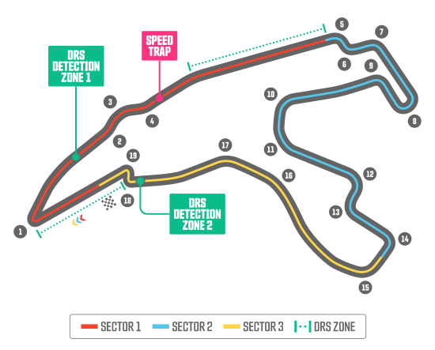

# Circuit de Spa-Francorchamps

## Podstawowe informacje

**Współczesna oficjalna nazwa:** Circuit de Spa-Francorchamps  
**Nazwa powszechnie używana:** Spa-Francorchamps / Spa  
**Lokalizacja współczesnego toru:** gminy Stavelot i Malmedy, prowincja Liège, Walonia, Belgia  
**Adres:** Route du Circuit 55, B-4970 Francorchamps  
**Operator:** S.A. de droit public „Le Circuit de Spa-Francorchamps”  
**Język nazwy:** francuski; `Spa` i `Francorchamps` są wcześniejszymi nazwami geograficznymi  
**Charakter nazwy:** geograficzny  
**Weryfikacja współczesnego nazewnictwa:** 16 sierpnia 2026

Ważna osobliwość geograficzna: mimo członu **Spa** w nazwie, współczesna nitka toru nie leży na terenie gminy Spa. Oficjalny materiał Circuit de Spa-Francorchamps wskazuje, że obecnie tor znajduje się wyłącznie na terenach gmin **Malmedy i Stavelot**.

## Układ toru

*Schemat na podstawie [ごひょううべこ, „2022 F1 CourseLayout Belgium.svg”, Wikimedia Commons](https://commons.wikimedia.org/wiki/File:2022_F1_CourseLayout_Belgium.svg), własna praca autora, licencja [CC BY-SA 4.0](https://creativecommons.org/licenses/by-sa/4.0/). W kopii przechowywanej w repozytorium dodano wyłącznie metadane dostępnościowe (`role`, `aria-labelledby`, `title` i `desc`); geometria i wygląd grafiki pozostały bez zmian. Zmodyfikowana wersja pozostaje na licencji CC BY-SA 4.0.*

Współczesny układ Grand Prix ma **7,004 km** i **19 zakrętów**. Jest to najdłuższy tor w aktualnym kalendarzu Formuły 1.

## Znaczenie nazwy

Nazwa składa się z francuskiego określenia rodzaju obiektu oraz dwóch nazw miejscowych:

- `Circuit de` – po francusku „tor / obwód [wyścigowy] w / od ...”; jest elementem opisowym, a nie właściwą etymologią;
- `Spa` – nazwa belgijskiej miejscowości uzdrowiskowej;
- `Francorchamps` – nazwa wsi, obecnie należącej do gminy Stavelot.

W zwykłym polskim użyciu **nie należy tłumaczyć** nazw `Spa` ani `Francorchamps`. Naturalna polska forma to **tor Spa-Francorchamps** albo pełna nazwa własna **Circuit de Spa-Francorchamps**.

## Skąd wzięła się nazwa toru

Nazwa toru jest geograficzna i wykorzystuje nazwy istniejące przed powstaniem obiektu.

Oficjalna historia toru opisuje spotkanie z 1920 roku w Francorchamps, podczas którego Jules de Thier, Henri Langlois van Ophem i baron Joseph de Crawhez uznali lokalną sieć dróg za odpowiednią do stworzenia trasy wyścigowej. Pierwotny, około piętnastokilometrowy układ prowadził drogami publicznymi w rejonie **Francorchamps, Malmedy i Stavelot**.

Pierwsze zawody odbyły się w 1921 roku. W kolejnych oficjalnych materiałach historycznych występują zarówno określenia związane z `Francorchamps`, jak i utrwalona pełna marka `Circuit de Spa-Francorchamps`.

Nie udało się znaleźć jednego źródła pierwotnego, które dokumentowałoby konkretny moment i formalny powód połączenia nazw **Spa** oraz **Francorchamps** w dzisiejszą nazwę obiektu. Dlatego nie należy dopowiadać np., że `Spa` dodano wyłącznie ze względów marketingowych. Pewne jest natomiast, że oba człony są wcześniejszymi nazwami geograficznymi regionu, a nie nazwami utworzonymi specjalnie dla toru.

## Etymologia nazwy Spa

Nazwa **Spa** jest znacznie starsza od toru i od współczesnego międzynarodowego rzeczownika `spa` oznaczającego uzdrowisko lub ośrodek odnowy biologicznej. Kierunek zależności jest odwrotny: to sława belgijskiej miejscowości sprawiła, że jej nazwa zaczęła funkcjonować w innych językach jako określenie miejsc związanych z wodami leczniczymi.

Nie należy traktować `SPA` jako historycznego skrótowca od łacińskich wyrażeń typu **`sanitas per aquam`** („zdrowie przez wodę”). Narodowe Centrum Kultury wskazuje wprost, że takie rozwinięcie nie ma związku z pochodzeniem wyrazu; jest późniejszym dopasowaniem do istniejącej nazwy.

Dla samej nazwy miejscowości szczególnie istotne jest recenzowane opracowanie językoznawcze Marie-Guy Boutier z Université de Liège. Autorka analizuje średniowieczne formy takie jak `Spaas`, `Spas`, `Spasse`, `Spaz`, `Spausse` i rekonstruuje jako źródło łacińskie **`*SPARSIS [AQUIS]`** – konstrukcję, w której rzeczownik `aquis` („wodami”) miał ulec elipsie, a `sparsis` określał charakter wód mineralnych.

Boutier wiąże łacińskie `sparsus` z właściwością wody mineralnej, której składniki ujawniają się lub rozdzielają. Rekonstrukcję osadza w starożytnym systemie nazewnictwa źródeł mineralnych i termalnych na obszarze dawnej civitas Tungrorum.

Dlatego najbezpieczniej rozumieć `Spa` jako **bardzo starą nazwę związaną z miejscowymi wodami mineralnymi**, a nie współczesny skrót ani prostą nazwę znaczącą „uzdrowisko”.

## Etymologia nazwy Francorchamps

`Francorchamps` również istniało na długo przed torem. Historyczne źródła klasztorów Stavelot-Malmedy poświadczają formę **`Francorcamp`** już około **1130–1131 roku**; później występuje również `Francorchamp`.

Pochodzenie nazwy jest jednak trudniejsze niż sugeruje jej współczesny wygląd. W starszej literaturze pojawia się interpretacja łacińska **`Francorum campus`**, tłumaczona jako „pole Franków” albo „obóz Franków”. Lokalna literatura historyczna również odnotowuje takie objaśnienia.

Nie należy jednak przedstawiać tej interpretacji jako bezspornej. Już Albert Counson w specjalistycznym artykule **„Francorchamps et la Francorum Semita”** z 1914 roku zwracał uwagę, że archaiczna nazwa wymaga analizy dawnych form i konkurujących wyjaśnień, a nie prostego rozłożenia współczesnego wyrazu.

Dlatego w tym opracowaniu przyjmujemy konserwatywną formułę:

- **bezpośrednie źródło członu nazwy toru:** wieś Francorchamps;
- **najstarsza dobrze udokumentowana forma:** `Francorcamp` (1130–1131);
- **historyczna hipoteza etymologiczna:** `Francorum campus` – „pole / obóz Franków”;
- **status:** hipoteza, nie rozstrzygnięta tu jako pewna etymologia.

## Historia toru i nazewnictwa

Tor narodził się w **1921 roku** na drogach publicznych regionu. Oficjalna historia Circuit de Spa-Francorchamps wskazuje m.in. następujące etapy:

- **1921** – początek historii wyścigowej obiektu;
- **1922** – Grand Prix organizowane przez RACB w Francorchamps;
- **1924** – pierwsze 24 Heures de Francorchamps;
- **1928** – nawierzchnia toru zostaje w pełni utwardzona;
- **1939** – powstaje Raidillon, zastępujący wcześniejszy zakręt przy dawnej komorze celnej;
- **1950** – przebudowa odcinka w rejonie Stavelot; Spa-Francorchamps znajduje się również w pierwszym sezonie mistrzostw świata Formuły 1;
- **1970** – ostatnie Grand Prix Formuły 1 na długim, dawnym układzie;
- **1979** – otwarcie nowego, około 6,9-kilometrowego układu, obejmującego nową sekcję od Les Combes do zakrętu Paul Frère;
- po kolejnych modyfikacjach długość osiąga obecne **7,004 km**;
- **2007** – nowa końcowa szykana zastępuje wcześniejszy układ kojarzony z `Bus Stop`;
- **2011** – powstaje publicznoprawna spółka akcyjna `Le Circuit de Spa-Francorchamps`, łącząca wcześniejsze podmioty zarządzające obiektem.

Współczesna oficjalna nazwa pozostaje **Circuit de Spa-Francorchamps** i nie zawiera stałego członu sponsorskiego.

## Nazwy charakterystycznych elementów toru

Spa-Francorchamps jest przykładem toru o wyjątkowo bogatym nazewnictwie wewnętrznym. Poniżej elementy podano w kolejności współczesnego okrążenia Grand Prix. Tam, gdzie nazwa albo jej pochodzenie zmieniały się lub pozostają niepewne, zaznaczono to wprost.

### La Source — zakręt 1

**Rodzaj:** nawrót.  
**Pochodzenie nazwy:** miejscowe źródła wody.

`La Source` dosłownie oznacza „źródło”. Oficjalny Circuit de Spa-Francorchamps oraz Formula 1 wiążą nazwę z licznymi źródłami wód występującymi w regionie, szczególnie kojarzonymi z Spa.

### Eau Rouge i Raidillon — zakręty 2–4

**Rodzaj:** słynna sekwencja prowadząca stromo pod górę.  
**Pochodzenie nazw:** potok Eau Rouge i opis nachylenia Raidillon.

Te dwie nazwy są często błędnie traktowane jako synonimy całego podjazdu.

**Eau Rouge** – dosłownie „czerwona woda” – jest nazwą potoku przepływającego pod torem u podstawy wzniesienia. Czerwawy kolor wiąże się z wysoką zawartością żelaza.

**Raidillon** jest właściwą nazwą stromego podjazdu i jego szczytu. Francuskie `raidillon` oznacza małą stromą drogę lub stromy podjazd. Element zbudowano w **1939 roku**, zastępując wolniejszy zakręt przy dawnej komorze celnej.

### Kemmel Straight

**Rodzaj:** długa prosta / wznoszący odcinek po Raidillon.  
**Pochodzenie nazwy:** niepewne.

Operator toru utrwala nazwę `Kemmel`, ale nie wyjaśnia jej pochodzenia w swoim opracowaniu nazw zakrętów. Formula 1 w 2026 roku wskazuje jedynie, że może ona nawiązywać do belgijskiej miejscowości Kemmel, jednocześnie zaznaczając brak pewności. Dlatego tej hipotezy nie przedstawiamy jako faktu.

### Les Combes — zakręty 5–6

**Rodzaj:** sekwencja zakrętów.  
**Pochodzenie nazwy:** ukształtowanie terenu.

Francuskie `combe` odnosi się do małej, wciętej doliny lub wąwozu. Oficjalny materiał toru właśnie w ten sposób objaśnia nazwę `Les Combes`.

### Malmedy — zakręt 7

**Rodzaj:** zakręt.  
**Pochodzenie nazwy:** miasto Malmedy.

Nazwa odwołuje się do pobliskiego Malmedy – jednej z miejscowości, które wraz z Francorchamps i Stavelot wyznaczały historyczny układ dróg wykorzystany przy tworzeniu toru.

### Bruxelles / Rivage — zakręt 8

**Rodzaj:** długi prawy zakręt.  
**Pochodzenie nazw:** Bruksela oraz pobliski przysiółek Rivage.

Współczesna Formula 1 używa nazwy **Bruxelles**, wiążąc ją ze stolicą Belgii. Starszą i nadal spotykaną nazwą jest **Rivage**; oficjalny Circuit de Spa-Francorchamps wyjaśnia ją jako nazwę pochodzącą od pobliskiego przysiółka.

### Jacky Ickx Curve — zakręt 9

**Rodzaj:** lewy zakręt.  
**Współczesne upamiętnienie:** Jacky Ickx.  
**Dawniejsze nazwy:** `Speaker Corner`, także `The Corner With No Name`.

Aktualne oficjalne materiały Formuły 1 określają zakręt jako **Jacky Ickx Curve**, upamiętniający belgijskiego kierowcę wyścigowego Jacky’ego Ickxa.

W starszym oficjalnym materiale samego toru występuje **Speaker Corner**: nazwa miała wynikać z faktu, że zakręt można było obserwować z dawnej kabiny komentatorów. Funkcjonowało również paradoksalne określenie **The Corner With No Name**.

Jest to dobry przykład nazwy, która zmieniła się bez potrzeby zmiany samej geometrii zakrętu.

### Pouhon / Double Gauche — zakręty 10–11

**Rodzaj:** szybki podwójny lewy zakręt.  
**Pochodzenie nazwy:** miejscowe źródła mineralne.

`Pouhon` jest regionalnym określeniem źródła ferruginicznej wody mineralnej. Oficjalny tor objaśnia je jako miejsce, „gdzie czerpie się wodę”.

Alternatywna francuska nazwa **Double Gauche** oznacza po prostu „podwójny lewy” i opisuje geometrię sekwencji.

### Fagnes / Pif-Paf — zakręty 12–13

**Rodzaj:** szybka sekwencja.  
**Pochodzenie głównej nazwy:** region Fagnes / Hautes Fagnes.

`Fagnes` odwołuje się do regionu wysokich torfowisk i mokradeł, w którym leży Francorchamps. Formula 1 podaje również lokalne określenie **Pif-Paf**, obrazowo odnoszące się do szybkiej zmiany kierunku w szykanie.

### Campus — zakręt 14

**Rodzaj:** zakręt.  
**Pochodzenie nazwy:** sąsiadujący Campus Automobile.

Nazwa pochodzi od położonego obok toru ośrodka **Campus Automobile**, centrum kompetencji i szkoleń technologicznych związanych m.in. z przemysłem samochodowym i motorsportem.

Formula 1 wskazuje, że wcześniej ten element był określany nazwą **Stavelot**, od pobliskiego miasta.

### Courbe Paul Frère — zakręt 15

**Rodzaj:** zakręt.  
**Patron:** Paul Frère.

Nazwa upamiętnia belgijskiego kierowcę wyścigowego i dziennikarza **Paula Frère’a**. Oficjalny tor podkreśla m.in. jego drugie miejsce w Grand Prix Belgii Formuły 1 w 1956 roku oraz znaczenie jako kierowcy i autora motoryzacyjnego.

Zakręt znajduje się przy połączeniu obecnego układu z dawną częścią trasy prowadzącą od Stavelot w stronę Blanchimont.

### Blanchimont — zakręty 16–17

**Rodzaj:** bardzo szybka podwójna lewa sekwencja.  
**Pochodzenie nazwy:** lokalna nazwa geograficzna; szczegół źródeł jest niespójny.

Oficjalny Circuit de Spa-Francorchamps z 2018 roku mówi, że `Blanchimont` zachowuje nazwę **wsi o tej samej nazwie**. Nowsze opracowanie Formula 1 z 2026 roku określa źródło nazwy jako **farmę położoną w pobliżu toru**.

Ponieważ dwa wiarygodne źródła różnią się w szczególe, wpis nie wybiera arbitralnie jednej wersji. Bezpieczny wniosek jest taki, że nazwa pochodzi od **lokalnego toponimu Blanchimont**, istniejącego niezależnie od toru.

Nie wyprowadzamy etymologii `Blanchimont` mechanicznie ze współczesnych francuskich słów `blanc` i `mont` bez osobnego źródła toponimicznego.

### Chicane / Bus Stop — zakręty 18–19

**Rodzaj:** końcowa szykana.  
**Nazwa współczesna:** `Chicane`; utrwalona nazwa historyczna/potoczna: `Bus Stop`.

`Bus Stop` nie jest metaforą. Gdy fragment toru był poza zawodami drogą publiczną, w tym miejscu rzeczywiście znajdował się przystanek autobusowy. W 2007 roku przebudowano końcową sekcję, lecz historyczna nazwa nadal funkcjonuje w języku motorsportu.

## Jak rozumieć nazwę po polsku

Najlepiej rozróżnić:

- **nazwa własna:** Circuit de Spa-Francorchamps;
- **zwyczajowa forma:** Spa-Francorchamps / Spa;
- **bezpośrednie źródło nazwy:** wcześniejsze nazwy geograficzne Spa i Francorchamps;
- **Spa:** bardzo stara nazwa związana etymologicznie z miejscowymi wodami mineralnymi; w opracowaniu ULiège rekonstruowana jako `*SPARSIS [AQUIS]`;
- **Francorchamps:** nazwa poświadczona jako `Francorcamp` już około 1130–1131 roku; `Francorum campus` jest historyczną hipotezą, a nie przyjętym tu bez zastrzeżeń tłumaczeniem;
- **lokalizacja dzisiejszego toru:** Stavelot i Malmedy; nie gmina Spa;
- **polskie użycie:** „tor Spa-Francorchamps”, bez tłumaczenia nazw własnych.

Nie należy więc tłumaczyć pełnej nazwy jako np. „Tor Zdrowia przez Wodę – Pole Franków”. Łączyłoby to późną etymologię ludową z niepewną hipotezą toponimiczną i dawałoby fałszywe wrażenie pewności.

## Źródła

### Źródła oficjalne i pierwotne

- [Circuit de Spa-Francorchamps – The most beautiful circuit in the world](https://www.spa-francorchamps.be/en/the-circuit) – oficjalna historia obiektu od 1921 roku, przebudowy, nowy układ z 1979 roku, długość 7,004 km i historia podmiotów zarządzających.
- [Circuit de Spa-Francorchamps – The corners of the Spa-Francorchamps Circuit](https://www.spa-francorchamps.be/en/news/96_the-corners-of-the-spa-francorchamps-circuit) – oficjalne objaśnienia nazw La Source, Eau Rouge, Raidillon, Kemmel, Les Combes, Bruxelles/Rivage, Speaker Corner, Pouhon, Fagnes, Campus, Paul Frère, Blanchimont i Chicane/Bus Stop; potwierdza także, że współczesny tor leży na terenach Malmedy i Stavelot.
- [Circuit de Spa-Francorchamps – Governance](https://www.spa-francorchamps.be/en/governance) – aktualny status operatora jako spółki akcyjnej prawa publicznego i struktura właścicielska; weryfikacja 16 sierpnia 2026 roku.
- [Circuit de Spa-Francorchamps – Contact](https://www.spa-francorchamps.be/en/contact?lg=en) – aktualny adres obiektu.
- [Circuit de Spa-Francorchamps – 100 years](https://www.spa-francorchamps.be/fr/news/231_le-circuit-de-spa-francorchamps-a-100-ans) – oficjalny materiał stulecia dotyczący powstania toru i pierwszego układu dróg w regionie.
- [Formula 1 – Circuit Guide: Spa-Francorchamps, 2026](https://www.formula1.com/en/latest/article/circuit-guide-everything-you-need-to-know-about-the-circuit-de-spa-francorchamps.pC5N3J3W9LEj8REFvU6FX.pC5N3J3W9LEj8REFvU6FX) – aktualne parametry: 7,004 km i 19 zakrętów.
- [Formula 1 – How every corner at Spa-Francorchamps got its name, 2026](https://www.formula1.com/en/latest/article/explained-how-every-corner-at-the-circuit-de-spa-francorchamps-got-its-name.1o6cyXf5F6q9VFFcgMqTqs.1o6cyXf5F6q9VFFcgMqTqs) – współczesne nazewnictwo zakrętów, numery, Jacky Ickx Curve oraz aktualne objaśnienia pochodzenia nazw; źródło również ujawnia niepewność dotyczącą Kemmel.
- [Formulae – Litterae – Chartae, Stavelot-Malmedy, nr 149](https://werkstatt.formulae.uni-hamburg.de/texts/urn:cts:formulae:stavelot_malmedy.halkin0150.lat001/passage/all) – edycja średniowiecznego wykazu dóbr klasztorów Stavelot i Malmedy z około 1130–1131 roku, zawierającego formę `Francorcamp`.

### Źródła językowe i toponimiczne

- [Marie-Guy Boutier, „Le nom de Spa, témoin d'un thermalisme antique dans la cité des Tongres. Sept étapes pour l'étymologie de Spa” – ORBi, Université de Liège](https://orbi.uliege.be/handle/2268/61088) – recenzowane opracowanie etymologii nazwy Spa, analiza historycznych form i rekonstrukcja `*SPARSIS [AQUIS]`.
- [Narodowe Centrum Kultury – SPA](https://nck.pl/projekty-kulturalne/projekty/ojczysty-dodaj-do-ulubionych/ciekawostki-jezykowe/spa%2Ccltt) – wyjaśnia, że traktowanie `spa` jako skrótowca od `sanus / salus / sanitas per aquam` jest błędne i że międzynarodowy wyraz pochodzi od belgijskiej nazwy miejscowej.
- [Albert Counson, „Francorchamps et la Francorum Semita”, Romania 43 (1914) – Persée](https://www.persee.fr/doc/roma_0035-8029_1914_num_43_171_4800) – specjalistyczne historyczne studium dawnych form i konkurujących wyjaśnień nazwy Francorchamps; pierwsza zachowana wzmianka lokowana jest w latach 1130–1131.
- [KANTL – Toponymisch Woordenboek: Francorchamps](https://bouwstoffen.kantl.be/tw/query/?arr=149&view=list) – zestaw dawnych form, m.in. `Francorcamp` (1130–31), `Francorcamp` (1138, 1172) i `Francorchamp` (1183).
- [SpaRéalités – Francorchamps](https://www.sparealites.be/francorchamps) – lokalne opracowanie historii wsi i zestawienie spotykanych hipotez `Francorum campus` / „champ des Francs” oraz dawnej formy `Francorcamp`.

### Źródło grafiki

- [Wikimedia Commons – 2022 F1 CourseLayout Belgium.svg](https://commons.wikimedia.org/wiki/File:2022_F1_CourseLayout_Belgium.svg) – autor ごひょううべこ, własna praca, CC BY-SA 4.0; współczesny układ Spa-Francorchamps z numerami 19 zakrętów, sektorami i oznaczeniami DRS.

---

## Stopka redakcyjna

**Redakcja:** Mikołaj Rotnicki.  
**Wsparcie badawcze i redakcyjne:** ChatGPT (OpenAI).  
**Charakter opracowania:** popularnonaukowe objaśnienie pochodzenia nazwy toru oraz nazw charakterystycznych elementów współczesnego układu.  
**Język opracowania:** polski; francuskie, walońskie i łacińskie formy nazw pozostawiane są w zapisie źródłowym.  
**Zasada źródłowa:** oddzielono bezpośrednie geograficzne źródło nazwy toru od głębszej etymologii nazw Spa i Francorchamps oraz udokumentowane użycie nazw elementów od dowodów ich pochodzenia.  
**Zasada niepewności:** `Francorum campus` potraktowano jako hipotezę dotyczącą Francorchamps; pochodzenie `Kemmel` pozostawiono niepewne; przy `Blanchimont` zachowano konflikt między oficjalnym materiałem toru z 2018 roku a Formula 1 z 2026 roku.  
**Zasada grafiki:** wykorzystano SVG CC BY-SA 4.0 z Wikimedia Commons; dodano wyłącznie metadane dostępnościowe bez zmiany geometrii i wyglądu.  
**Ostatnia aktualizacja:** 16 sierpnia 2026.
