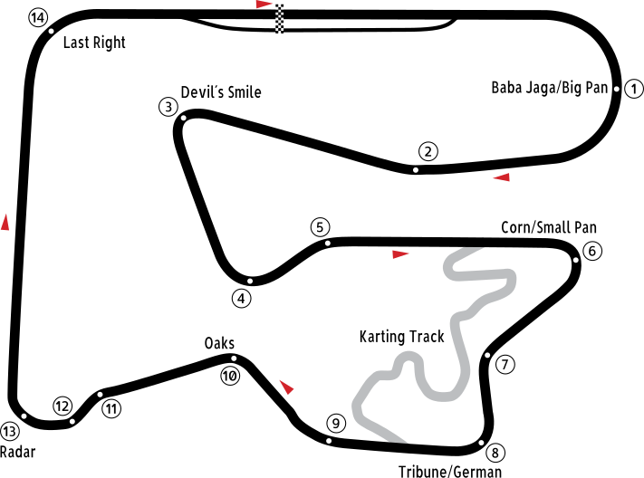

# Tor Poznań

## Podstawowe informacje

**Współczesna nazwa:** Tor Poznań  
**Operator:** Automobilklub Wielkopolski  
**Adres obiektu:** ul. Wyścigowa 3, 62-081 Przeźmierowo  
**Region:** aglomeracja poznańska, województwo wielkopolskie, Polska  
**Język nazwy:** polski  
**Charakter nazwy:** geograficzny – od nazwy miasta Poznań  
**Weryfikacja współczesnego nazewnictwa:** 16 sierpnia 2026

## Układ toru

*Schemat na podstawie [Maggot666PL, „Poznań GP layout.svg”, Wikimedia Commons](https://commons.wikimedia.org/wiki/File:Pozna%C5%84_GP_layout.svg), licencja [CC BY-SA 3.0](https://creativecommons.org/licenses/by-sa/3.0/). Plik jest własną pracą autora; w historii Wikimedia Commons odnotowano także techniczną konwersję fontów na ścieżki wykonaną przez użytkownika G04T. W kopii przechowywanej w repozytorium dodano wyłącznie metadane dostępności (`role`, `aria-labelledby`, `title` i `desc`); geometria i wygląd grafiki nie zostały zmienione. Zmodyfikowana wersja pozostaje na licencji CC BY-SA 3.0.*

## Znaczenie nazwy

W przeciwieństwie do nazw takich jak `Laguna Seca` czy `Kyalami`, nazwa **Tor Poznań** nie wymaga tłumaczenia na język polski – jest już polską nazwą własną.

Jej budowa jest bezpośrednia:

- `Tor` – określa rodzaj obiektu;
- `Poznań` – nazwa geograficzna odwołująca się do miasta i aglomeracji poznańskiej.

Naturalne znaczenie nazwy to po prostu **„tor wyścigowy związany z Poznaniem”**.

Warto przy tym zaznaczyć, że współczesny adres obiektu znajduje się w **Przeźmierowie**, przy zachodniej granicy Poznania. Oficjalne materiały Automobilklubu Wielkopolski konsekwentnie posługują się jednak nazwą `Tor Poznań`.

## Skąd wzięła się nazwa Poznań

Ponieważ człon `Poznań` jest właściwym elementem znaczeniowym nazwy toru, jego etymologia wymaga osobnego wyjaśnienia.

W językoznawczej tradycji nazwa miasta jest wywodzona od dawnej **nazwy osobowej Poznan**. Stanisław Rospond w *Słowniku etymologicznym miast i gmin PRL* objaśniał Poznań jako nazwę dzierżawczą, czyli pierwotnie miejsce lub gród związany z człowiekiem noszącym imię **Poznan**.

W uproszczonym polskim objaśnieniu można więc powiedzieć:

**Poznań = „gród / miejsce Poznana”.**

Nie oznacza to jednak, że znamy historycznego założyciela miasta o tym imieniu. Samo pochodzenie językowe od nazwy osobowej jest czym innym niż udokumentowana biografia konkretnego człowieka.

Źródła omawiające Rosponda wskazują również, że dawna nazwa powstała z użyciem starego przyrostka dzierżawczego, którego ślad w obecnej formie widoczny jest w miękkim `ń`.

## Legenda „Poznaję!”

Popularna legenda mówi, że Lech, Czech i Rus po długiej rozłące spotkali się nad Cybiną, rozpoznali się i mieli zawołać **„Poznaję!”**, od czego później miała powstać nazwa Poznań.

Miasto Poznań samo przytacza tę opowieść w materiałach poświęconych lokalnym legendom. Jest ona ważnym elementem tradycji kulturowej, ale **nie jest językoznawczą etymologią nazwy miasta**.

W opracowaniu należy więc rozróżniać:

- **etymologię językową:** nazwa od dawnej nazwy osobowej `Poznan`;
- **legendę ludową:** skojarzenie z okrzykiem „Poznaję!”.

## Związek nazwy z powstaniem toru

Historia Toru Poznań jest dobrze udokumentowana przez Automobilklub Wielkopolski.

**18 listopada 1974 roku** Mieczysław Biliński, Roman Szczerkowski i Marek Kuk przedstawili władzom Automobilklubu Wielkopolski pomysł wykorzystania starych pasów startowych lotniska **Ławica** do budowy toru samochodowego.

W lutym 1975 roku prezes Automobilklubu Wielkopolski i dyrektor Fabryki Samochodów Rolniczych `POLMO`, **Andrzej Bobiński**, zaproponował połączenie interesów klubu i fabryki poprzez stworzenie obiektu o wszechstronnym przeznaczeniu. `POLMO` zostało głównym inwestorem przedsięwzięcia.

Pierwsze prace drogowe rozpoczęły się w **maju 1975 roku**. Dokumentację i kształt toru opracował mgr inż. **Roman Jankowski** po konsultacjach z działaczami Automobilklubu Wielkopolski.

Uroczyste otwarcie **Toru Poznań nastąpiło 1 grudnia 1977 roku**.

Nazwa `Tor Poznań` funkcjonowała od początku jako geograficzne oznaczenie nowego obiektu związanego z poznańskim środowiskiem motoryzacyjnym i z terenem dawnego lotniska Ławica. Nie ma ona charakteru sponsorskiego ani patronackiego.

## Dalsza historia obiektu

**18 października 1980 roku** oddano do eksploatacji tor kartingowy.

Początkowo Tor Poznań należał do Fabryki `POLMO`, później znajdował się w zarządzie poznańskiego Ośrodka Sportu i Rekreacji. Decyzją Prezydenta Miasta Poznania nr 24/82 z **24 sierpnia 1982 roku** obiekt wraz z infrastrukturą został przekazany Automobilklubowi Wielkopolskiemu.

Współczesny główny tor samochodowo-motocyklowy ma długość **4083 m**, szerokość 12 m i 14 zakrętów. Kierunek jazdy jest zgodny z ruchem wskazówek zegara.

## Jak rozumieć nazwę po polsku

Najlepiej rozróżnić:

- **nazwa własna obiektu:** Tor Poznań;
- **rodzaj nazwy:** nazwa geograficzna;
- **bezpośrednie odniesienie:** miasto i aglomeracja poznańska;
- **pochodzenie nazwy `Poznań`:** od dawnej nazwy osobowej `Poznan`;
- **naturalne objaśnienie historyczne:** „gród / miejsce Poznana”;
- **etymologia ludowa:** legenda o okrzyku „Poznaję!”.

Nie ma potrzeby tworzyć dodatkowego polskiego tłumaczenia nazwy Tor Poznań. W wersjach obcojęzycznych można tłumaczyć rzeczownik określający rodzaj obiektu, ale `Poznań` pozostaje nazwą własną miasta.

## Źródła

### Źródła oficjalne i pierwotne

- [Automobilklub Wielkopolski – Tor Poznań](https://www.aw.poznan.pl/tor-poznan-1) – oficjalna historia powstania obiektu, szczegółowa chronologia 1974–1982, współczesne parametry toru i adres.
- [Automobilklub Wielkopolski – Kontakt](https://www.aw.poznan.pl/kontakt) – współczesna nazwa, operator i adres Toru Poznań; weryfikacja 16 sierpnia 2026 roku.
- [Automobilklub Wielkopolski – Zdarzyło się...](https://www.aw.poznan.pl/zdarzylo-sie) – archiwalne materiały klubu, w tym otwarcie Toru Poznań w 1977 roku i późniejsze wydarzenia.
- [Automobilklub Wielkopolski – 90 lat minęło...](https://www.aw.poznan.pl/aktualnosci/90-lat-minelo) – biogram Andrzeja Bobińskiego i potwierdzenie jego udziału w budowie toru oddanego do użytku w 1977 roku.

### Źródła językowe i historyczne

- Stanisław Rospond, *Słownik etymologiczny miast i gmin PRL*, Zakład Narodowy im. Ossolińskich, 1984 – podstawowe opracowanie językoznawcze wykorzystywane do etymologii nazwy Poznań; [opis bibliograficzny w Google Books](https://books.google.com/books/about/S%C5%82ownik_etymologiczny_miast_i_gmin_PRL.html?id=KR5FAAAAIAAJ).
- [Poznańskie Klimaty – „Poznań – pochodzenie nazwy miasta”](https://www.poznanskieklimaty.pl/poznan-pochodzenie-nazwy-miasta/) – omówienie hasła Rosponda: pochodzenie od nazwy osobowej `Poznan`, interpretacja jako „gród Poznana” oraz wyjaśnienie dawnego przyrostka.
- [Poznan.pl – Poznańskie legendy](https://www.poznan.pl/mim/main/poznanskie-legendy%2Cp%2C25064%2C25075%2C25081.html) – oficjalny miejski materiał dokumentujący legendarną, ludową interpretację nazwy związaną z okrzykiem „Poznaję!”. Źródło wykorzystane jako zapis tradycji, nie jako podstawa etymologii językowej.

### Źródło grafiki

- [Wikimedia Commons – Poznań GP layout.svg](https://commons.wikimedia.org/wiki/File:Pozna%C5%84_GP_layout.svg) – schemat Toru Poznań autorstwa Maggot666PL, własna praca, licencja CC BY-SA 3.0; aktualna wersja pliku z 7 stycznia 2012 roku.

---

## Stopka redakcyjna

**Redakcja:** Mikołaj Rotnicki.  
**Wsparcie badawcze i redakcyjne:** ChatGPT (OpenAI).  
**Charakter opracowania:** popularnonaukowe objaśnienie pochodzenia nazwy toru oraz etymologii nazwy geograficznej, od której została utworzona.  
**Język opracowania:** polski; historyczne nazwy osobowe pozostawiane są w formie źródłowej.  
**Zasada źródłowa:** historia obiektu została oparta przede wszystkim na materiałach jego operatora, a etymologia `Poznania` została oddzielona od miejscowej legendy.  
**Zasada grafiki:** zachowano autora, źródło i licencję; w lokalnej kopii SVG dodano wyłącznie metadane dostępności.  
**Ostatnia aktualizacja:** 16 sierpnia 2026.
